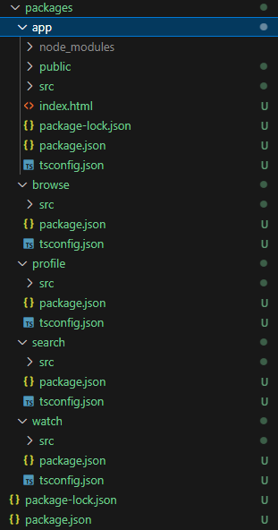

# Monorepos vs Micro&nbsp;Frontends

---

<style scoped>
section {
  justify-content: normal;
}
</style>

# Agenda

1) Introduction to the sample project
2) Transformation to a monorepo
3) Advantages and Disadvantages
4) Transformation to Micro Frontends
5) Quick evaluation
6) Summary

---

<style scoped>
section {
  justify-content: normal;
}
</style>

# Caution

✨ This session is all about code.

⚠️ All coding will be done live.

---

<style scoped>
section {
  justify-content: normal;
}
</style>

# Sample Project

See codebase: [piral-samples/christmas-sample](https://github.com/piral-samples/christmas-sample)

* Netflix clone
* Currently monolithic
* Has a sound architecture already
* Primary goal: Make codebase more accessible

---

# Project Progress

<style scoped>
li {
  list-style: none;
}
</style>

- ⬜️ Create monorepo
- ⬜️ Migrate to monorepo
- ⬜️ Create app shell
- ⬜️ Migrate to micro frontends

---

```json
{
  "name": "christmas-demo-monorepo",
  "workspaces": [
    "packages/*"
  ],
  "scripts": {
    "start": "npm run start --workspace=christmas-demo-app"
  }
}
```

---

<style scoped>
li {
  list-style: none;
}
</style>

# Project Progress

- ✅ Create monorepo
- ⬜️ Migrate to monorepo
- ⬜️ Create app shell
- ⬜️ Migrate to micro frontends

---



---

```ts
// "main": "src/index.ts"
import './style.scss';
import { lazy } from 'react';

export type * from './types';

export const MovieTile = lazy(() => import('./MovieTile'));
export const WatchPage = lazy(() => import('./WatchPage'));
```

---

<style scoped>
li {
  list-style: none;
}
</style>

# Project Progress

- ✅ Create monorepo
- ✅ Migrate to monorepo
- ⬜️ Create app shell
- ⬜️ Migrate to micro frontends

---

<style scoped>
section {
  columns: 2;
  display: block;
}

h1 {
  column-span: all;
}

h2 {
  break-before: column;
}

section > p {
    column-span: all;
}

section > p:last-child {
    margin-top: 2rem;
    font-size: 0.5rem;
}

li {
  list-style: none;
}
</style>

# Pros and Cons

Monorepos bring to the table:

- 👍 Improves architecture
- 👍 Reusable packages
- 👍 Reveals structure

- 👎 Increased complexity
- 👎 Needs to publish all
- 👎 Increased build time

The disadvantages can be partially mitigated by additional tooling (Nx, TurboRepo, ...).

---

```sh
npm i piral-core piral-cli
```


```json
{
  "app": "./src/index.html",
  "importmap": {
    "imports": {},
    "inherit": ["piral-base", "piral-core"]
  },
}
```

---

```jsx
const instance = createInstance({
  state: {
    components: {
      Layout,
      LoadingIndicator: Loading,
    },
    routes: {
      "/": () => <Navigate to="/browse" />,
      "/browse": () => <BrowsePage MovieTile={MovieTile} />,
      "/profile": () => <ProfilePage />,
      "/watch/:media_type/:video_id": () => <WatchPage />,
    },
  },
  requestPilets() {
    return Promise.resolve([]);
  },
});

root.render(<Piral instance={instance} />);
```

---

<style scoped>
li {
  list-style: none;
}
</style>

# Project Progress

- ✅ Create monorepo
- ✅ Migrate to monorepo
- ✅ Create app shell
- ⬜️ Migrate to micro frontends

---

```jsx
const instance = createInstance({
  state: {
    components: {
      Layout,
      LoadingIndicator: Loading,
    },
    routes: {
      "/": () => <Navigate to="/browse" />,
    },
  },
  requestPilets() {
    return Promise.resolve([]);
  },
});
```

---

```jsx
const GeneralMenu: React.FC = () => {
  return (
    <div id="navigation" className="Navigation">
      <nav>
        <ExtensionSlot
          name="menu"
          render={(nodes) => (
            <ul>
              {nodes.map((node, i) => (
                <li key={i}>{node}</li>
              ))}
            </ul>
          )}
        />
      </nav>
    </div>
  );
};
```

---

```jsx
import * as React from "react";
import { PiletApi } from "christmas-demo-app";

import "./style.scss";

const SearchExtension = React.lazy(() => import("./SearchExtension"));

export function setup(api: PiletApi) {
  const MovieTile = (props) => (
    <api.Extension name="movie-tile" params={props} />
  );
  api.registerExtension("header-items", () => (
    <SearchExtension MovieTile={MovieTile} />
  ));
}
```

---

<style scoped>
li {
  list-style: none;
}
</style>

# Project Progress

- ✅ Create monorepo
- ✅ Migrate to monorepo
- ✅ Create app shell
- ✅ Migrate to micro frontends

---

<style scoped>
section {
  justify-content: normal;
}
</style>

# Summary

* Monorepos help to make packages reusable
* Packages helps to have a sound architecture
* Micro Frontends are all about loose coupling!
* Micro Frontends *can* live in a monorepo
